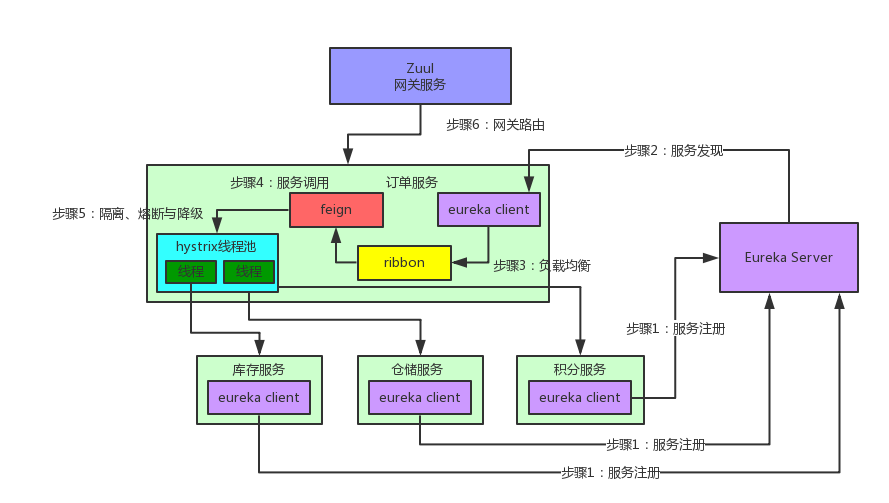

# SpringCloudDemo

### 技术栈
+ Eureka 服务的注册于发现
+ Hystrix 服务的熔断防止故障扩散
+ Feign 服务的调用以及均衡负载
+ SpringCloudConfig 服务集群配置中心
+ SpringCloudZuul 服务网关，基于JVM路由和服务端的负载均衡器
+ SpringCloudZipkin 链路追踪
+ SpringCloudGateway 升级版的服务网关

### 架构图地址

### SpringCloud 与 SpringBoot版本匹配关系

| Spring Cloud    | Spring Boot    |
| :---:  | :---:   |
| Finchley   | 兼容Spring Boot 2.0.x，不兼容Spring Boot 1.5.x    | 
| Dalston和Edgware   | 兼容Spring Boot 1.5.x，不兼容Spring Boot 2.0.x      | 
| Camden   | 兼容Spring Boot 1.4.x，也兼容Spring Boot 1.5.x      |
| Brixton   | 兼容Spring Boot 1.3.x，也兼容Spring Boot 1.4.x   |
| Angel   | 兼容Spring Boot 1.2.x     |
--------------------- 

### SpringCloud 与 SpringBoot的版本列表查看地址

+ spring-cloud-dependencies版本列表查看：
https://mvnrepository.com/artifact/org.springframework.cloud/spring-cloud-dependencies

+ spring-boot-starter-parent版本列表查看：
https://mvnrepository.com/artifact/org.springframework.boot/spring-boot-starter-parent

